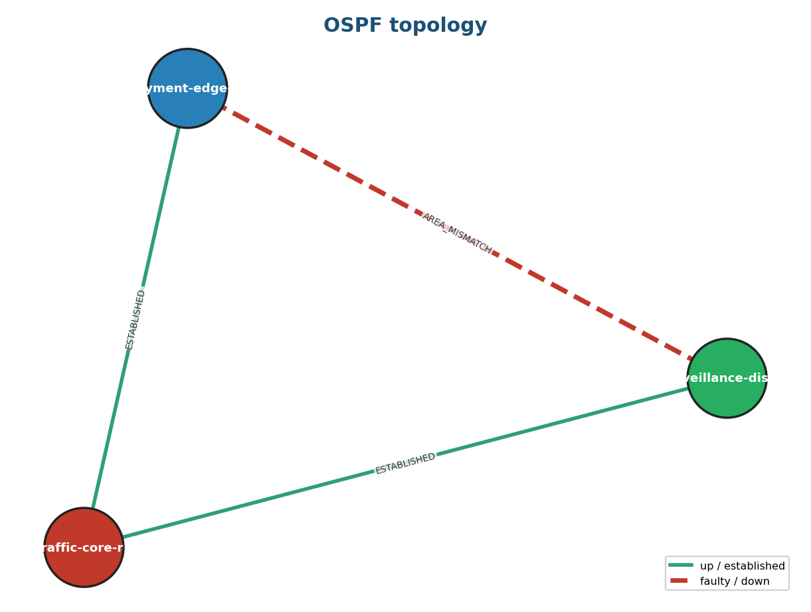
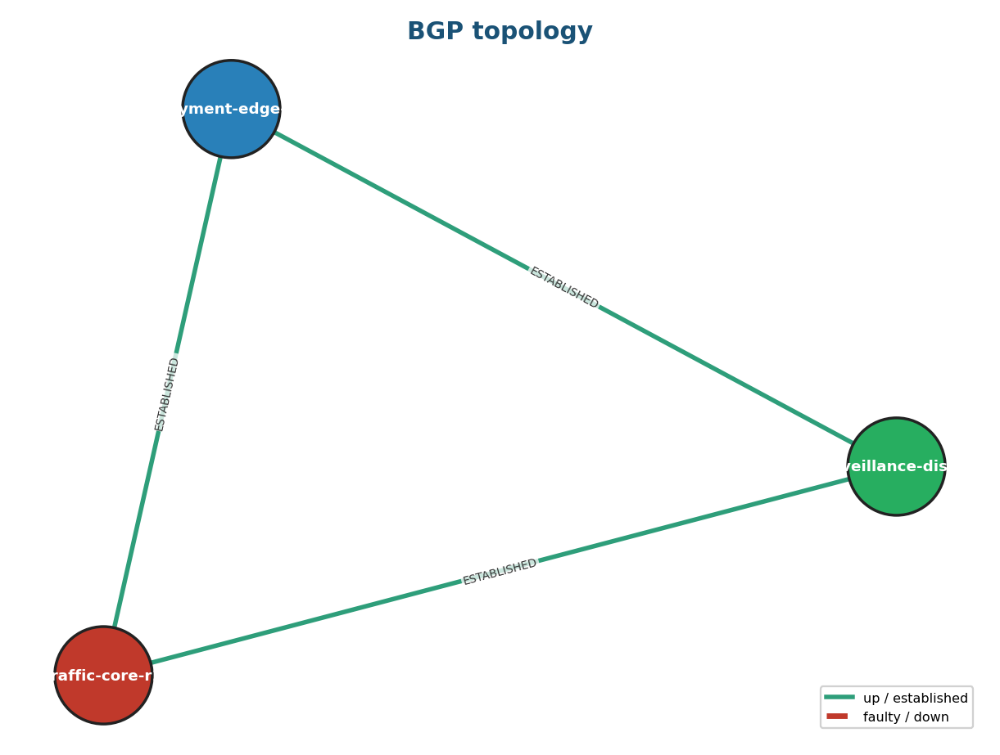

# CamNet — AI Network Intelligence for Smart Cities

CamNet builds a **vendor-neutral digital twin** of a city network from device
configs (Batfish), runs a security/health assertion suite, classifies every
finding **Low / Medium / High**, lets operators **chat with an AI** about the
network in plain language, draws **L3 / OSPF / BGP topology maps**, and exports a
**one-click PDF report**.

> Hackathon MVP — streamlined to **2 containers**: a Flask `app` (UI + REST API +
> engine + LLM + PDF) and the official `batfish` digital-twin engine.

## Topology visuals

CamNet renders interactive (vis-network) and static topology maps for every
layer, colouring nodes by smart-city role and drawing **faulty sessions as red
dashed edges**. Below is the OSPF layer from the bundled sample network — note the
planted **`AREA_MISMATCH`** fault on the `surveillance ↔ payment` link that the
digital twin caught (reachability still holds, rerouting via the core):



| Layer 3 | BGP |
|---------|-----|
|  |  |

> These are real artifacts generated by the running app (`/api/topology/<layer>`).
> Drop your own UI screenshots into `docs/` to showcase the chat console.

## Quick start (Windows + Docker Desktop)

```bash
cp .env.example .env          # optional: paste a Gemini key (see below)
docker compose up --build
# open http://localhost:8080
```

First boot pulls the Batfish image and waits ~30s for it to be ready. If the very
first **Run analysis** says "Batfish may still be starting", wait a moment and
click again.

## Enabling real Gemini AI (optional)

The demo runs **fully offline** out of the box using a deterministic heuristic
mock for chat + threat scoring. To switch on real Google Gemini:

1. Get a key at <https://aistudio.google.com/apikey>
2. Edit `.env` and replace the placeholder:
   ```
   GEMINI_API_KEY=AIza...your-real-key...
   ```
3. `docker compose up --build` (or restart the `app` container).

The **Gemini** service pill flips from `mock` to `live` when the key is active.

## The demo flow

1. **Run analysis** (local source) → models the network, runs Batfish asserts,
   renders 3 topology PNGs, scores threats.
2. Right rail fills with **severity counts** + **finding cards**; left rail lists
   discovered **devices** with their smart-city roles.
3. **Chat**: try *"list devices"*, *"what are the threats"*, *"which checks
   failed"*, *"tell me about the missing ACL"*, *"is the payment LAN reachable"*.
4. Tick **Reachability check** (e.g. `192.168.10.10` → `192.168.30.10`) and
   re-run to get a pre-deploy reachability verdict.
5. **Download PDF report** → multi-page PDF with assertions, threats,
   reachability, and topology maps.

## The sample network

Three Cisco IOS routers modeling a smart city (OSPF area 0 + iBGP AS 65001):

| Device                  | Role               | LAN              |
|-------------------------|--------------------|------------------|
| `traffic-core-r1`       | Traffic control    | 192.168.10.0/24  |
| `surveillance-dist-r2`  | Surveillance       | 192.168.20.0/24  |
| `payment-edge-r3`       | Digital payments   | 192.168.30.0/24  |

**Planted issue:** `payment-edge-r3`'s untrusted internet uplink applies
`ip access-group MISSING-ACL in`, but that ACL is never defined — so the intended
filter is silently absent. CamNet flags it as an **undefined reference**.

Drop your own Batfish-supported configs into `configs/configs/` to analyze a real
network.

## Architecture

```
Browser ─:8080─▶ app (Flask)
                  ├ /                three-pane chat console
                  ├ /api/analyze    Batfish asserts + topo + threat scoring
                  ├ /api/chat       grounded NL chat (Gemini | mock)
                  ├ /api/report     reportlab PDF
                  ├ /api/topology/* L3 / OSPF / BGP graph PNG
                  └──pybatfish──▶ batfish/allinone (:9997)
```

| Path             | Method | Purpose                                  |
|------------------|--------|------------------------------------------|
| `/api/health`    | GET    | service status pills                     |
| `/api/analyze`   | POST   | `{source, give_topology, ip_ping_check_flag, ip_map}` → `{analysis, threats}` |
| `/api/devices`   | GET    | discovered devices + roles               |
| `/api/chat`      | POST   | `{message}` → `{reply}`                   |
| `/api/report`    | GET    | PDF                                      |
| `/api/topology/<layer3\|ospf\|bgp>` | GET | PNG                       |

## Layout

```
hakaton/
├─ docker-compose.yml          # app + batfish
├─ .env.example
├─ configs/configs/*.cfg       # sample smart-city configs (with planted issue)
└─ src/app/
   ├─ app.py        Flask routes + in-memory state
   ├─ engine.py     Batfish wrapper: asserts, reachability, topology
   ├─ llm.py        Gemini + deterministic mock (threats + chat)
   ├─ report.py     reportlab PDF
   ├─ templates/index.html     three-pane console
   ├─ requirements.txt
   └─ Dockerfile
```

## Testing

41 tests cover every feature — 31 fast unit tests (mocked, no Batfish/Gemini)
and 10 live integration tests (real Batfish + PDF + separated-session simulation).

```bash
# with the stack running (docker compose up), run inside the app container:
docker exec camnet-app pip install -q pytest requests
docker cp tests camnet-app:/app/tests
docker exec camnet-app python -m pytest /app/tests -q
```

- `tests/test_unit.py` — intent parsing & negation, assertion detail + device
  filtering, mock threat scoring, key scrubbing, inventory/chats CRUD, Jinja2
  template management, the ReAct agent (routing/responder), and every API route
  via the Flask test client (analyze, chat, topology, inventory, templates,
  agent-prompt, config edit, global error handler).
- `tests/test_live.py` — end-to-end against the running stack: analyze finds the
  planted faults, OSPF topology shows the red `AREA_MISMATCH` edge, PDF renders,
  rich device details, chat respects "no PDF", chat history persists, and the
  separated-session what-if simulation detects a duplicate router-id / resolves
  the area mismatch (skips automatically if the stack is down).

## Notes / limits (MVP)

- State is in-memory (single worker) — fine for a demo.
- Anomaly detection is config-derived (Batfish asserts + LLM reasoning); no live
  syslog/NetFlow yet.
- NetBox inventory path is deferred; local configs are the demo source.
